一個簡單的 python flask app CI/CD 實作。
注意，下面任何操作的帳號密碼都是 `gogolook`。

## 簡單架構圖
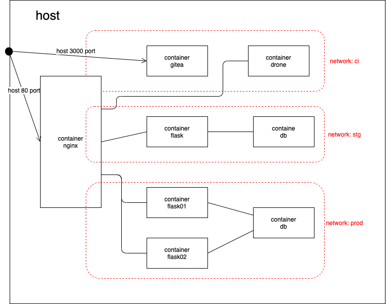

## requirment
docker / docker-compose / Makefile

## quick start

# step 1. 
設定 host，將下列內容貼到 /etc/hosts
```
127.0.0.1 gitea
127.0.0.1 drone-server
127.0.0.1 flask.gogolook.com
127.0.0.1 promethus.gogolook.com
127.0.0.1 flask.gogolook-stg.com
127.0.0.1 promethus.gogolook-stg.com
```

# step 2. 
clone repo
```
$> git clone https://github.com/genchilu/gogolook-task
```

# step 3. 
進入 repo 目錄以後，架設 demo 環境
```
$> docker-compose up -d
```

# step 4. 
此時打開瀏覽器，瀏覽 `http://gitea:3000/gogolook/flask-realworld-example-app` 可以看到下面 repo 頁面
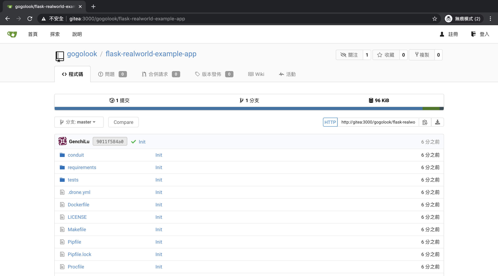

# step 5. 
此時打開瀏覽器，瀏覽 `http://promethus.gogolook-stg.com/targets` 可以看到 stg 的監控，此時 flack app 尚未部署，healthy 顯示異常，如下：
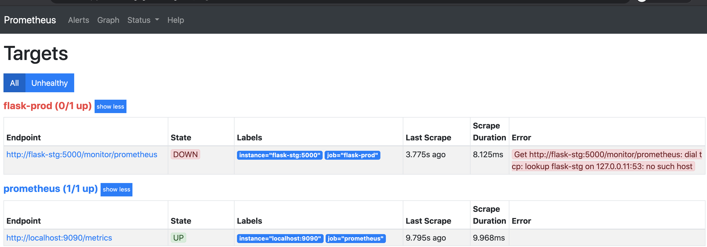

# step 6. 
此時打開瀏覽器，瀏覽 `http://promethus.gogolook.com/targets` 可以看到 prod 的監控，此時 flack app 尚未部署，healthy 顯示異常，如同 stg 一樣。
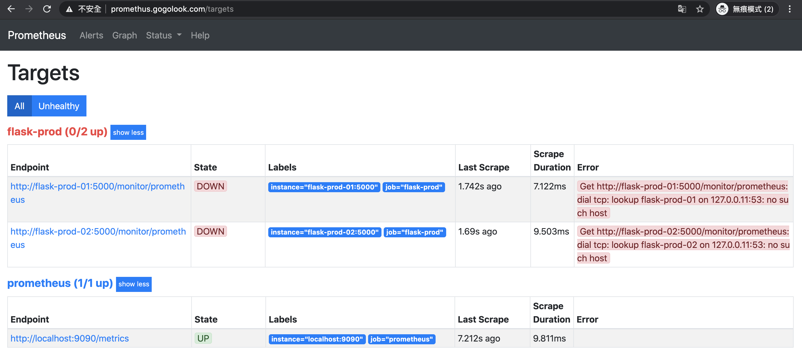

# step 7.
從 gitea 上 clone repo，修改後 push 回去，可以觸發 unit test
> ps1. 合併分支亦可
> ps2. 帳號密碼為 gogolook
```
$> git clone http://gitea:3000/gogolook/flask-realworld-example-app
$> cd flask-realworld-example-app
$> touch test && git add . && git commit -m "test ci"  
$> git push origin master
```

可以看到紅色框框處有觸發 CI 的連結，如下圖
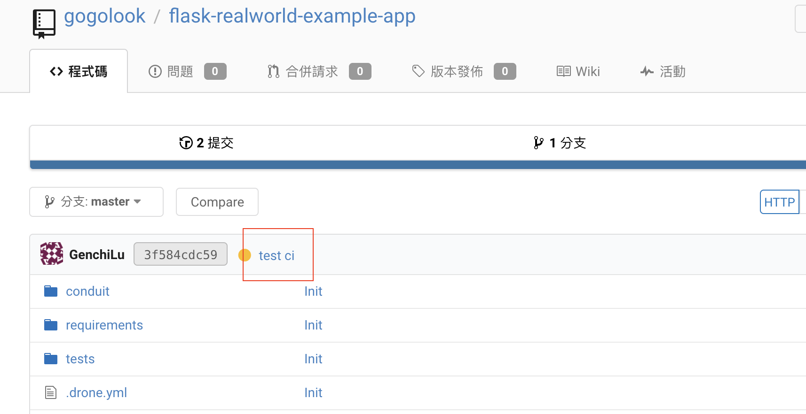

# step 8. 
點擊 CI 連結會進到 DroneCI，可以看到測試內容如下：
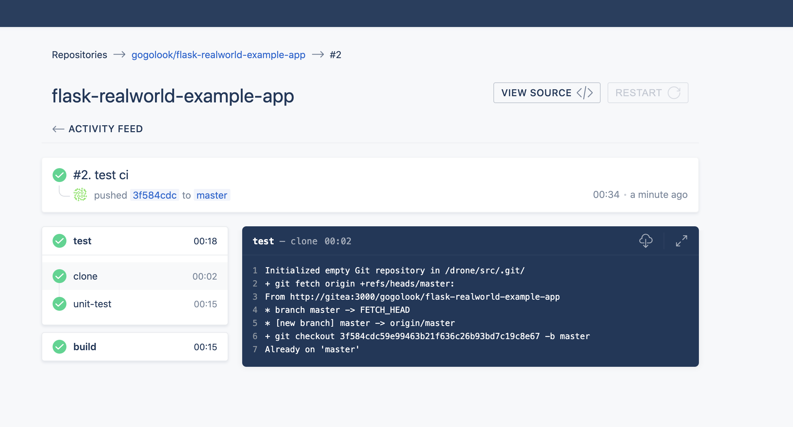

# step 9. 
migrate db，在 flask-realworld-example-app 專案目錄下執行下面指令 migrate db
```
make migrate TAG=local
```
> db schema 變更不包含在本專案的 CI/CD 流程

# step 10. 
發佈至 stg。到 gitea 的 release 頁 `http://gitea:3000/gogolook/flask-realworld-example-app/releases`，發布新的 release。在填入版本 1.0.0-rc1，點選發布，如下圖
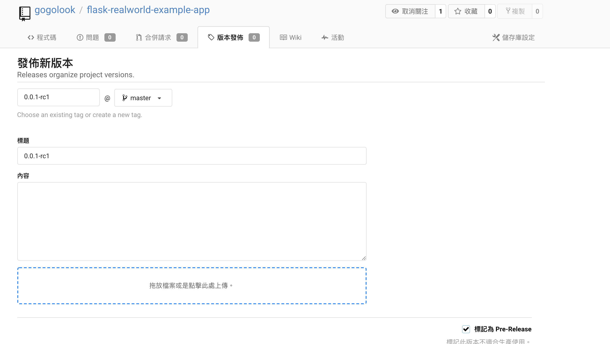
> 僅有 x.x.x-rcx 這樣格式的 tag 會被發佈到 stg，x 為數字。

# step 11. 
到 DroneCI 的專案頁面 `http://drone-server/gogolook/flask-realworld-example-app` 可以看到觸發部署到 stg 的任務，如下圖：
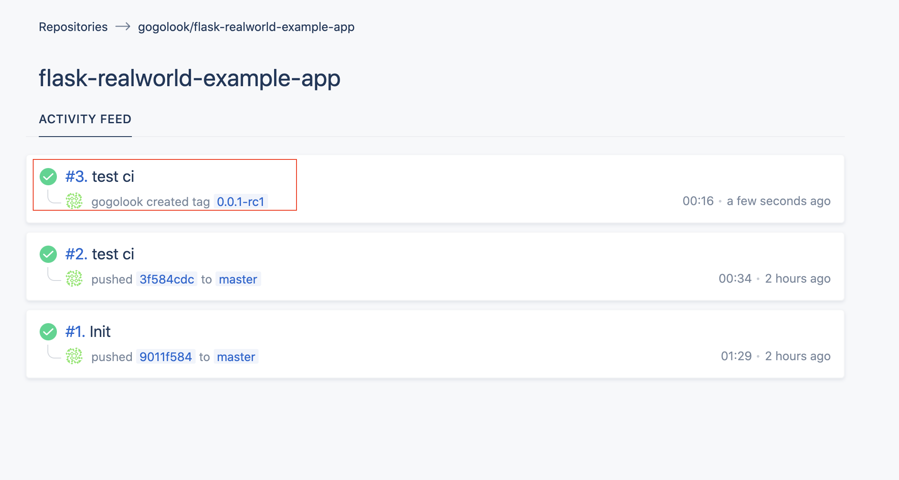

# step 12. 
點擊 create tag 產生的任務，可以看到有 deploy 的 job，如下圖：
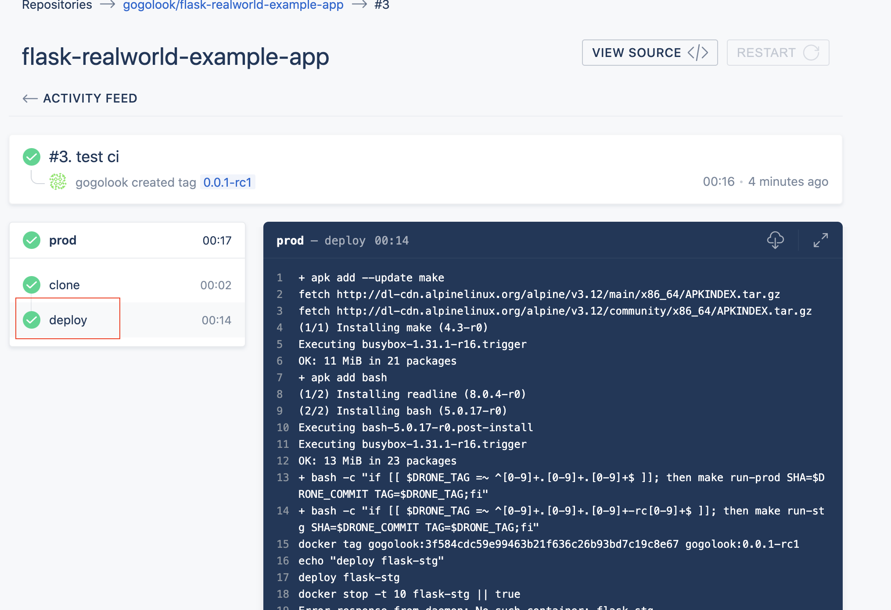

# step 13. 
至 stg 監控頁面 `http://promethus.gogolook-stg.com/targets` 可以看到 stg 的 falsk healthy check 變綠色了
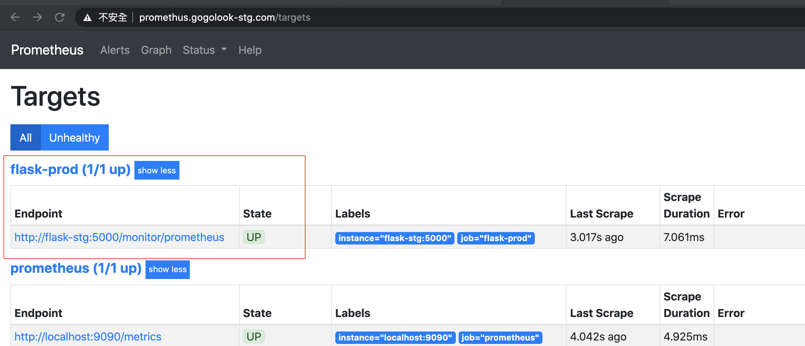

# step 14. 
測試 stg api `http://flask.gogolook-stg.com/api/articles`

# step 15. 
在 command line 執行 `docker ps`，可以看到 stg 的 container 和版本，如下圖：
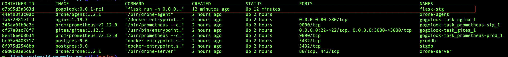

# step 16. 
發佈至 stg。到 gitea 的 release 頁 `http://gitea:3000/gogolook/flask-realworld-example-app/releases`，發布新的 release。在填入版本 1.0.0，點選發布。
> 僅有 x.x.xx 這樣格式的 tag 會被發佈到 prod，x 為數字。

# step 17. 
一樣在 drone 專案頁面 `http://drone-server/gogolook/flask-realworld-example-app` 可以看到觸發的部署任務，可以看到 prod 環境會部署兩個 container，採用 rolling update 的方式，一次部署一台，避免更新期間服務壞掉，如下圖：
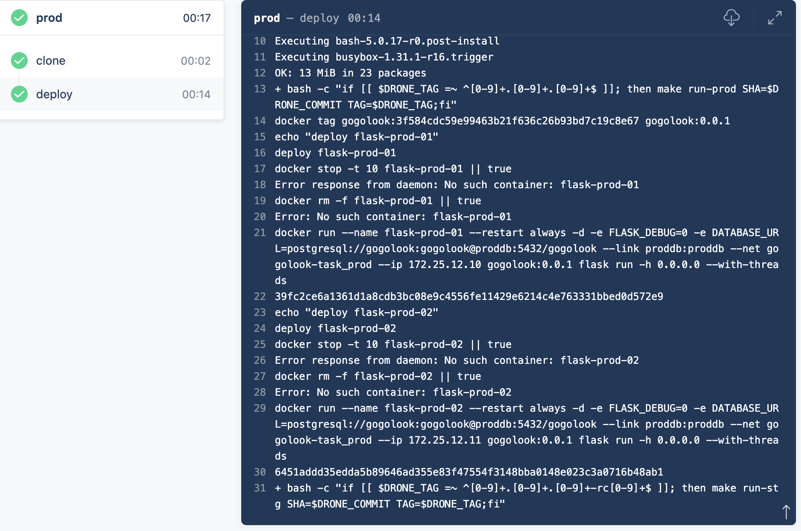

# step 18. 
如同 stg 環境，此時 prod 環境的監控頁面可以看到 flask 活過來了，有兩台：
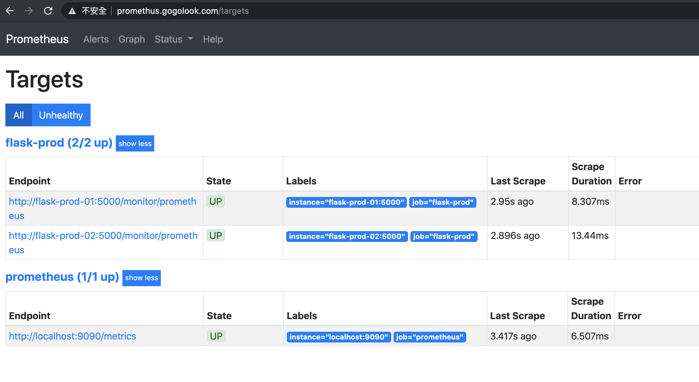

# step 19. 
測試 prod api `http://flask.gogolook.com/api/articles`


## 系統列表
* 版控平台：http://gitea:3000/gogolook/flask-realworld-example-app
* ci 平台：http://drone-server/gogolook/flask-realworld-example-app
* stg 監控：http://promethus.gogolook-stg.com/targets
* stg api: http://promethus.gogolook-stg.com/targets
* prod 監控：http://promethus.gogolook.com/targets
* prod api：http://flask.gogolook.com/api/articles

## 清掃
```
$> bash clean.sh
```
> 注意這個腳本是把所有 docker 內帶有 gogolook 的 cotainer 和 image 都清空，請務必確認會不會砍到其他不必要的 image/container。
